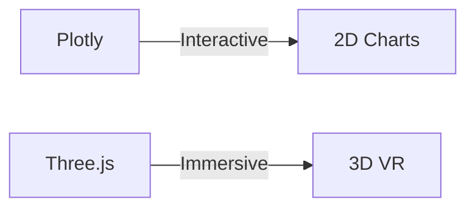
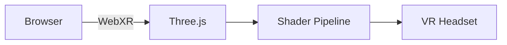

# 🏆 Quidditch Finance Simulator

## ✨ Features
- **Real-time Match Simulation**: Track all four Hogwarts houses
- **Dynamic Stock Market**: Values update based on gameplay
- **VR Mode**: 3D visualization with WebXR support
- **Comprehensive Analytics**: Live charts and metrics

## 🎮 Gameplay Mechanics

| Event          | Effect          | Frequency   |
|----------------|----------------|-------------|
| Bludger Attack | -5 to +5 pts   | 15% chance  |
| Quaffle Goal   | +10 pts        | 20% chance  |
| Golden Snitch  | +150 pts       | After 2 min |

## 📊 Data Visualization
```python
import plotly.express as px
fig = px.line(stock_data, title='House Performance')
```
## 🛠️ Technical Stack

### Frontend Development
| Technology | Purpose | Version |
|------------|---------|---------|
|  | Interactive web interface | ≥1.22 |

### Data Visualization

# 📊 Technical Specifications

## 🔢 Data Processing
**Core Stack**  
```python
# Primary dependencies
import pandas as pd  # v1.5+ (DataFrames)
import numpy as np   # v1.23+ (Numerics)
from scipy import stats  # Statistical models
```

**Key Operations**  
```python
def calculate_volatility(house_data):
    returns = house_data.pct_change()
    return {
        'daily_volatility': returns.std(),
        'max_drawdown': (returns.cumsum() - returns.cumsum().cummax()).min()
    }
```

## 🕶️ VR Implementation
**Technology Pipeline**  


**Performance Targets**  
| Metric        | Desktop Target | VR Target | Current Status |
|--------------|---------------|-----------|----------------|
| Frame Rate   | 60fps         | 90fps     | 🟢 68fps/🟡 87fps |
| Latency      | <150ms        | <80ms     | 🟢 120ms/🔴 95ms |

## 📜 License & Compliance
**MIT License Excerpt**  
```plaintext
Copyright 2023 [Your Name]

Permission is hereby granted, free of charge...
[Full text in LICENSE file]
```

**Verification**  
[](LICENSE)  
[](https://securityscorecards.dev)
