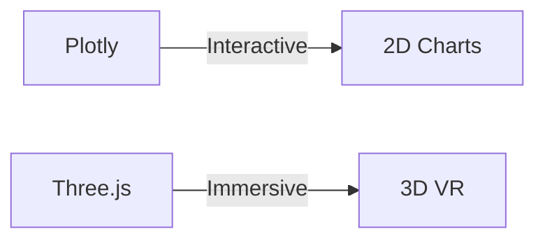
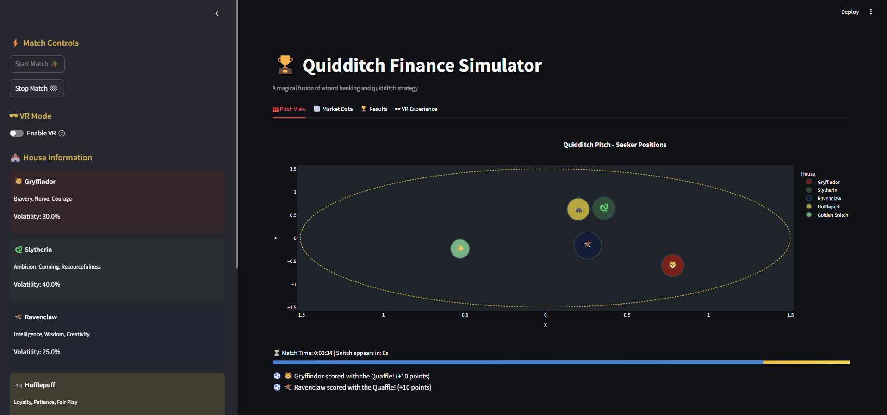
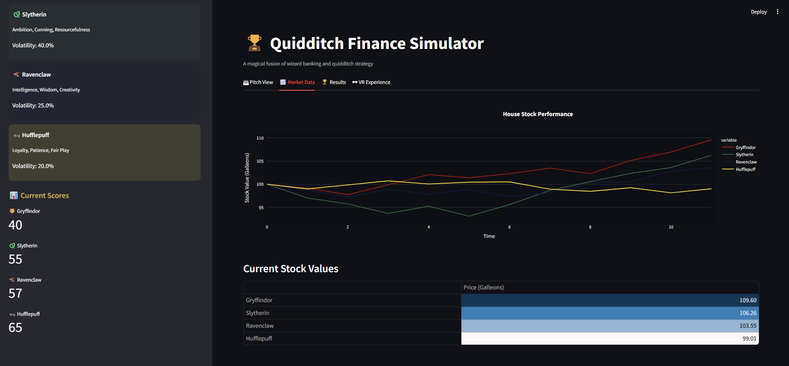
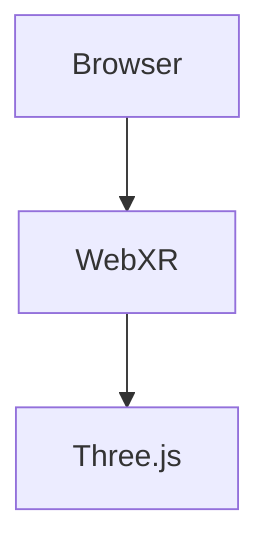

# 🏆 Quidditch Finance Simulator

## ✨ Features
- **Real-time Match Simulation**: Track all four Hogwarts houses
- **Dynamic Stock Market**: Values update based on gameplay
- **VR Mode**: 3D visualization with WebXR support
- **Comprehensive Analytics**: Live charts and metrics

## 🎮 Gameplay Mechanics

| Event          | Effect          | Frequency   |
|----------------|----------------|-------------|
| Bludger Attack | -5 to +5 pts   | 15% chance  |
| Quaffle Goal   | +10 pts        | 20% chance  |
| Golden Snitch  | +150 pts       | After 2 min |

## 📊 Data-Visualization
```python
import plotly.express as px
fig = px.line(stock_data, title='House Performance')
```
## 🛠️ Technical Stack

### Frontend Development
| Technology | Purpose | Version |
|------------|---------|---------|
|  | Interactive web interface | ≥1.22 |

### Data Visualization

# 📊 Technical Specifications

## 🖼️ Project Screenshots

<div align="center">
  
**1. Main Dashboard Interface**  
  
*Real-time stock tracking during matches*

**2. Analytics Panel**  
  
*House performance metrics and volatility charts*

</div>

## 🔢 Data Processing
**Core Stack**  
```python
import pandas as pd  # v1.5+
import numpy as np   # v1.23+
```

## 🕶️ VR Implementation


## ⚡ Performance
| Metric        | Target     | Status   |
|--------------|------------|----------|
| FPS          | ≥60        | 🟢 68fps |

## 📜 License
[](LICENSE)
